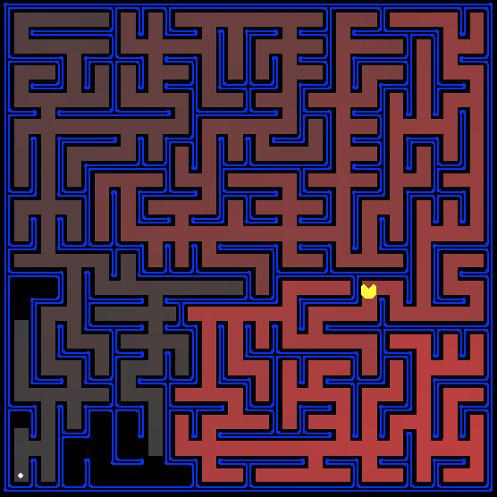

# 🎮 Pacman AI — Search Algorithms

<p align="center">
  
</p>

<p align="center">
  <b>Implementation of classic AI search algorithms (DFS, BFS, UCS, A*) applied to Pacman navigation problems.</b><br/>
  Based on the UC Berkeley CS188 Intro to AI course — Project 1: Search.
</p>


##  Overview

This project implements general-purpose search algorithms and applies them to Pacman as a search agent. Pacman must navigate mazes, collect food, and avoid ghosts — all framed as search problems.

---

##  Search Algorithms

All algorithms are implemented in `search.py`:

| Algorithm | Function | Data Structure | Optimal? | Complete? |
|-----------|----------|---------------|----------|-----------|
| Depth-First Search | `depthFirstSearch` | Stack (LIFO) | ❌ | ✅ |
| Breadth-First Search | `breadthFirstSearch` | Queue (FIFO) | ✅ | ✅ |
| Uniform Cost Search | `uniformCostSearch` | Priority Queue | ✅ | ✅ |
| A* Search | `aStarSearch` | Priority Queue | ✅ | ✅ |

### A* Heuristics (in `searchAgents.py`)
- **Manhattan Heuristic** — for single-goal navigation
- **Corners Heuristic** — for visiting all 4 corners
- **Food Heuristic** — for eating all food dots

---

##  Project Structure
```
pacman-search/
├── __pycache__/            # Python bytecode cache (auto-generated)
├── layouts/                # Maze layout files (.lay)
├── search.py               #  Core search algorithms (DFS, BFS, UCS, A*)
├── searchAgents.py         #  Search-based Pacman agents & heuristics
├── pacman.py               # Main game engine
├── game.py                 # Game state, rules, and agent logic
├── ghostAgents.py          # Ghost behavior (Random, Directional)
├── pacmanAgents.py         # Simple Pacman agents (Greedy, LeftTurn)
├── keyboardAgents.py       # Human keyboard control (WASD / Arrow keys)
├── layout.py               # Maze layout loader
├── graphicsDisplay.py      # Tkinter visual display
├── graphicsUtils.py        # Low-level graphics primitives
├── textDisplay.py          # Text-only display mode
├── eightpuzzle.py          # 8-puzzle search problem
├── util.py                 # Stack, Queue, PriorityQueue, Counter
├── autograder.py           # Automated grading system
├── grading.py              # Grade tracking and output
├── testClasses.py          # Test case base classes
├── testParser.py           # Test file parser
├── searchTestClasses.py    # Search-specific test cases
├── projectParams.py        # Project configuration
├── highlight.css           # Syntax highlighting styles
├── projects.css            # Project page styles
├── maze.png                # Maze screenshot
└── commands.txt            # All runnable demo commands
```

---

##  Getting Started

### Prerequisites

- Python 3.x
- Tkinter (included with standard Python)
```bash
# Clone the repository
git clone https://github.com/MAIRImanar/pacman-search.git
cd pacman-search

# Run Pacman (no dependencies to install!)
python pacman.py
```

---

## Usage & Commands

### Basic Run
```bash
python pacman.py
```

### DFS — Depth-First Search
```bash
python pacman.py -l tinyMaze -p SearchAgent
python pacman.py -l mediumMaze -p SearchAgent
python pacman.py -l bigMaze -z .5 -p SearchAgent
```

### BFS — Breadth-First Search
```bash
python pacman.py -l mediumMaze -p SearchAgent -a fn=bfs
python pacman.py -l bigMaze -p SearchAgent -a fn=bfs -z .5
```

### UCS — Uniform Cost Search
```bash
python pacman.py -l mediumMaze -p SearchAgent -a fn=ucs
python pacman.py -l mediumDottedMaze -p StayEastSearchAgent
python pacman.py -l mediumScaryMaze -p StayWestSearchAgent
```

### A* — A-Star Search
```bash
python pacman.py -l bigMaze -z .5 -p SearchAgent -a fn=astar,heuristic=manhattanHeuristic
```

### Corners Problem
```bash
python pacman.py -l tinyCorners -p SearchAgent -a fn=bfs,prob=CornersProblem
python pacman.py -l mediumCorners -p SearchAgent -a fn=bfs,prob=CornersProblem
python pacman.py -l mediumCorners -p AStarCornersAgent -z 0.5
```

### Food Search
```bash
python pacman.py -l testSearch -p AStarFoodSearchAgent
python pacman.py -l trickySearch -p AStarFoodSearchAgent
python pacman.py -l bigSearch -p ClosestDotSearchAgent -z .5
python pacman.py -l bigSearch -p ApproximateSearchAgent -z .5 -q
```

### Keyboard Controls

| Key | Direction |
|-----|-----------|
| `W` / `↑` | North |
| `S` / `↓` | South |
| `A` / `←` | West |
| `D` / `→` | East |
| `Q` | Stop |

---

## 🧩 Eight Puzzle
```bash
python eightpuzzle.py
```

---

## 🧪 Autograder
```bash
# Run all tests
python autograder.py

# Grade a specific question
python autograder.py -q q1

# Run a single test
python autograder.py -t test_cases/q1/graph_bfs_vs_dfs
```

---

## 👤 Author


 MAIRI  Manar 
 [@MAIRImanar](https://github.com/MAIRImanar) 

---

## 📄 Credits

Original Pacman AI projects developed at **UC Berkeley** by John DeNero and Dan Klein.  
More info: [http://ai.berkeley.edu](http://ai.berkeley.edu)

---

<p align="center">Made with ❤️ by <a href="https://github.com/MAIRImanar"><strong>MAIRImanar</strong></a></p>
